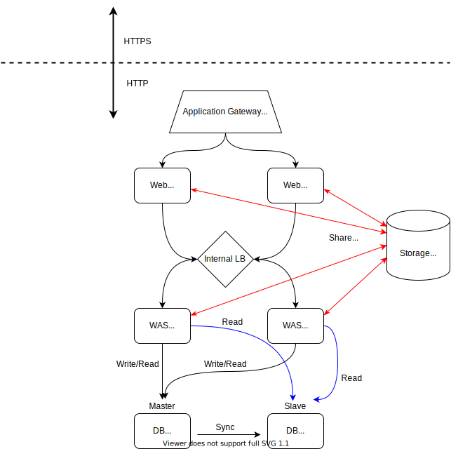
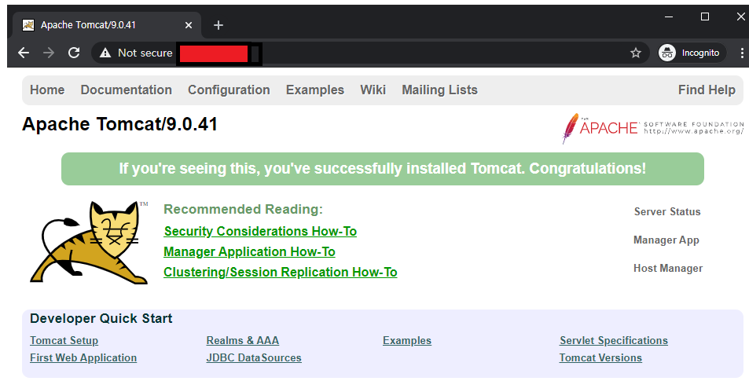
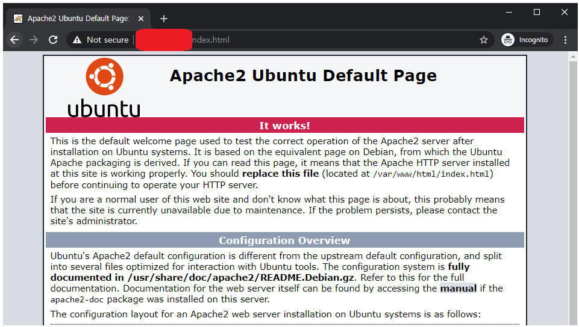
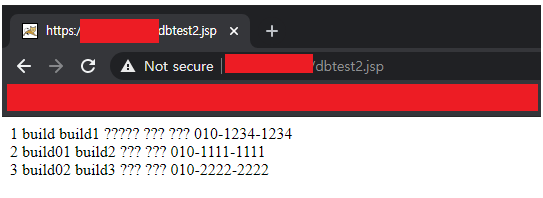
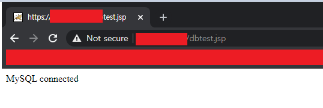

# 3tier 2중화 & Azure Fileshare & TLS Termination



## Setup

**Infra**: Microsoft Azure

**Network**: 1 Vnet, 3 Subnet(web,was,db)

- Vnet Address Space: 192.168.0.0/16
    - Gateway Subnet: 192.168.0.0/27
    - Subnet 1: 192.168.1.0/24
    - Subnet 2: 192.168.2.0/24
    - Subnet 3: 192.168.3.0/24

**Storage**: FileShare

**VM OS:** Ubuntu 18.04-LTS

**Middleware**

- Web: Apache/2.4.29 (Ubuntu)
- WAS: Tomcat-9.0.43
- Database: MySQL Ver 14.14 Distrib 5.7.33

**NSG**(Network Security Group)

- subnet01: Allow 80,443
- subnet02: Allow 8009
- subnet03: Allow 3306

### Fileshare

apache, tomcat 작업 하기전 Mount 해놓고 시작하는게 추후 작업하기에 편리함

```bash
# WebServer와 WasServer의 DocumentRoot를 일치시키기 위함
StorageAccount
1. Fileshare 생성
2. Networking -> Private Endpoint - web,was subnet에 등록
3. web,was 서버에서 apache와 tomcat의 DocumentRoot에 Fileshare Mount
(Mount 작업시 기존 파일들 백업 필수)
apache mount point -> /var/www/html/
tomcat mount point -> /usr/local/tomcat9/webapps/ROOT/

* apache documentroot 수정 -> /etc/apache2/site-available/000-default.conf
...
DocumentRoot /var/www/html/webapps/ROOT
...

즉, apache와 tomcat의 DocumentRoot가 통합되어 한 경로에서 관리가 가능해진다.
```

## WEB - Apache

### Step

1. Install apache2

    ```bash
    apt update -y && apt install -y apache2
    ```

2. Install & Configure mod-jk connector

    ```bash
    apt install -y libapache2-mod-jk
    cp /etc/libapache2-mod-jk/worker.propertiex /etc/apache2/

    vi /etc/apache2/worker.properties
    		worker.list=ajp13_worker
    		worker.ajp13_worker.port=8009
    		worker.ajp13_worker.host=192.168.2.4 # tomcat 서버 주소(or 2중화시 internal lb ip)
    		worker.ajp13_worker.type=ajp13

    vi /etc/apache2/mods-available/jk.conf
    <IfModule jk_module>
    ...
    JkWorkersFile /etc/apache2/workers.properties
    ...

    vi /etc/apache2/sites-available/000-default.conf
    <VirtualHost *:80>
    ...
    # static to apache, dynamic to tomcat
    SetEnvIf Request_URI "/*.html" no-jk
    # SetEnvIf Request_URI "/*.css" no-jk
    SetEnvIf Request_URI "/*.jpg" no-jk
    SetEnvIf Request_URI "/*.jpeg" no-jk
    SetEnvIf Request_URI "/*.png" no-jk
    SetEnvIf Request_URI "/*.gif" no-jk
    JkMount /* ajp13_worker
    ...
    </VirtualHost>
    ```

- Detail Description

    ```bash
    apt update -y && apt install -y apache2

    설정파일경로
    /etc/apache2
    .
    ├── conf-available
    ├── conf-enabled
    ├── mods-available
    ├── mods-enabled
    ├── sites-available
    └── sites-enabled
    └── apache2.conf
    └── ports.conf
    └── envvars
    └── magic

    conf, mods, sites
    └──> 각각 available 디렉토리에 고급 설정이나 추가 기능파일을 포함, 이 중 사용하고자 하는 기능들을
    enabled 디렉토리에 심볼릭 링크를 만들어 사용한다.(apache2.conf 파일안에 enabled 디렉토리를 Include 하고 있다)
    └──> 수동 추가방법
    sudo ln -s 추가할기능 해당enabled디렉터리
    └──> apache2 내장 명령어 사용
    conf-available의 기능 추가 : a2enconf
    conf-available의 기능 삭제 : a2disconf
    mods-available의 기능 추가 : a2enmod
    mods-available의 기능 삭제 : a2dismod
    sites-available의 기능 추가 : a2ensite
    sites-available의 기능 삭제 : a2dissite

    기본 설정 -> apache2.conf
    apache2.conf에서 읽어오는 기본 호스트 설정 -> site-enabled/000-default.conf

    루트 디렉토리를 사용자마다 하나씩 만들도록 하는 명령
    a2enmod userdir -> mods-available디렉토리에서 userdir.conf와 userdir.load 두 파일의 심볼릭 링크가 mods-enabled 디렉토리에 생성된다.

    설정완료 후 서비스 재시작
    ```

    ### mod-jk 커넥터

    ```bash
    # 설치
    apt install -y libapache2-mod-jk

    # 기본 설치 경로
    /etc/libapache2-mod-jk
    .
    ├── httpd-jk.conf -> ../apache2/mods-available/jk.conf
    └── workers.properties

    # 기본 설치 경로에서 작업해도 되고, 심볼릭 링크가 가르키는 jk.conf를 수정해도됨 둘 중 한가지 선택
    # workers.properties 에는 worker가 연동할 톰캣의 정보와 동작방식, 포트 등 을 편집한다
    # worker파일의 경로는 jk.conf에 경로가 명시되어 있다.
    # worker파일도 꼭 기본 설치경로에서 하지않아도 되며 
    # apache2의 설치경로인 /etc/apache2 에 넣어주고 jk.conf에서 경로를 편집해주면 된다.

    # Step
    1. /etc/libapache2-mod-jk/worker.propertiex 파일 복사 -> /etc/apache2(apache's home)

    2. worker.properties 편집
    # workers.tomcat_home=/usr/local/tomcat9/ # APACHE와 TOMCAT이 같은 서버에 있을때만 설정
    # workers.java_home=/usr/lib/jvm/java-11-openjdk-amd64 # # APACHE와 TOMCAT이 같은 서버에 있을때만 설정

    worker.list=ajp13_worker

    worker.ajp13_worker.port=8009
    worker.ajp13_worker.host=192.168.2.4 # tomcat 서버 주소(internal lb ip)
    worker.ajp13_worker.type=ajp13

    3. /etc/apache2/mods-available/jk.conf 편집
    <IfModule jk_module>
    ...
    JkWorkersFile /etc/apache2/workers.properties # 복사 하여 편집한 워커 파일 경로
    ...

    4. /etc/apache2/sites-available/000-default.conf 편집
    <VirtualHost *:80>
    ...
    # static to apache, dynamic to tomcat
    SetEnvIf Request_URI "/*.html" no-jk
    # SetEnvIf Request_URI "/*.css" no-jk
    SetEnvIf Request_URI "/*.jpg" no-jk
    SetEnvIf Request_URI "/*.jpeg" no-jk
    SetEnvIf Request_URI "/*.png" no-jk
    SetEnvIf Request_URI "/*.gif" no-jk
    JkMount /* ajp13_worker # worker.properties에 worker.list에 등록된 이름, 커스텀 가능
    ...
    </VirtualHost>

    ** ※ 특정 유형(js)의 파일만 아파치에서 처리할 경우
    SetEnvIf Request_URI "/*.js$" no-jk  # $ == 문자의 끝 의미, jsp도 금지하는걸 방지, .js뒤에 $가 없을경우 .jsp도 아파치에서 처리하게됨
    JkMount /* tomcat1
    **
    ```

## WAS - Tomcat

### Step

1. Install Java

    ```bash
    apt update -y && apt-get install openjdk-11-jdk

    vi /etc/environment
    		JAVA_HOME="/usr/lib/jvm/java-11-openjdk-amd64"
    ```

2. Install & Configure Tomcat 

    ```bash
    wget https://downloads.apache.org/tomcat/tomcat-9/v9.0.43/bin/apache-tomcat-9.0.43.tar.gz
    tar -zvxf apache-tomcat-9.0.43.tar.gz
    mv apache-tomcat-9.0.43 /usr/local/tomcat9

    vi /usr/local/tomcat9/conf/server.xml
    		<Connector protocol="AJP/1.3"
                    address="0.0.0.0"
    								**secretRequired="false" # ssl 통신해제**
                    port="8009"
                    redirectPort="8443" />
    ```

3. Start Tomcat Server

    ```bash
    /usr/local/tomcat9/bin/startup.sh
    ```

- Detail Description

    ### Java 설치

    ```bash
    sudo apt update -y
    # 설치(Open JDK/JRE), 택 1
    sudo apt-get install default-jdk
    sudo apt-get install openjdk-<VSERSION>-jdk
    sudo apt-get install default-jre
    sudo apt-get install openjdk-<VERSION>-jre (jre만을 원한다면)

    apt-get install openjdk-11-jdk

    # 환경변수 설정(JAVA_HOME)
    sudo vi /etc/environment
    JAVA_HOME="/usr/lib/jvm/java-<VERSION>-openjdk-amd64"
    source /etc/environment

    # Managing java
    sudo update-alternatives --config java
    ```

    ### Tomcat 설치

    ```bash
    # tomcat 홈페이지에서 원하는 버전의 톰캣 버전 선택후 tar.gz 파일 다운로드(wget)
    # https://tomcat.apache.org
    wget <TOMCAT's tar.gz>
    # 압축해제
    tar -zxvf <TOMCAT's tar.gz>
    # /usr/local로 압축 해제 한 파일 이동
    # (*/usr/local은 로컬에 설치되는 각종 프로그램을 위치시키는 권장 경로, 배포판에서 사용하지 않는 사용자 설치에 사용됨)
    mv apache-tomcat-9.0.41 /usr/local/tomcat9

    # tomcat config파일 편집
    # TOMCATHOME/conf/server.xml
    # protocol -> AJP 부분 주석 해제 및 편집(line 116)
    <Connector protocol="AJP/1.3"
                    address="0.0.0.0"
    								**secretRequired="false" # ssl 통신해제**
                    port="8009"
                    redirectPort="8443" />
    # tomcat 재시작
    ```

### Azure LoadBalancer

```bash
# Configuration
- 내부(Internal)
- SKU: 표준(Standard)
- 백앤드풀(WAS Servers)
- 상태프로브: 8009/tcp -> Tomcat's port
- 부하분산규칙(8009/tcp -> Tomcat's port)
```

- Detail Description
    - 상태 프로브
        - 상태 프로브가 백앤드 풀의 인스턴스의 HealthCheck를 하고 비정상이면 트래픽을 전송하지 않는다.
        - 상태 프로브의 Port는 응답 가능한 Port로 설정해야한다(꼭 App이 사용하는 Port가 아니여도 응답이 가능한 Port를 설정해주자)

### Azure Application Gateway(SSL/TLS Termination)

```bash
# Application Gateway
* 계층: 표준 v2
1. .pfx 인증서 생성(pem+key) (생성시 입력한 암호 기록 필수)
2. 리소스 생성
	- application gateway용 subnet생성(vnet당 1개의 appgw만 가능)
	- 프론트앤드 설정 - 공용 IP 설정
	- 대상없이 백앤드 추가
	- 라우팅 규칙 추가
		1. 프론트의 HTTPS규칙 및 리스너 설정 -> .pfx 파일 업로드
		2. 백앤드풀의 HTTP 규칙 설정
3. 생성한 Application Gateway의 Backendpool에 Web Server 추가
```

## Database - MySQL

### Step

1. Install mysql

    ```bash
    apt update -y && apt install -y mysql-server
    ```

2. Configure mysql

    ```bash
    mysql_secure_installation #초기 셋팅

    # tomcat서버에서 사용할 유저 생성
    # 1. database 생성
    CREATE DATABASE hyukjun_db;
    SHOW DATABASES;
    # 2 생성한 database를 사용하는 계정 생성, '%'는 모든 주소 나타냄, 경우에 따라 특정 주소해도 되고 localhost로 자신의 pc만 설정해도됨
    CREATE USER 'hyukjun'@'%' IDENTIFIED BY 'PASSWORD';
    # 3. FLUSH PRIVILEGES 로 mysql의 user테이블에 추가하거나 변경이 있는 경우 이를 반영시켜줌
    FLUSH PRIVILEGES;
    # 4. 생성된 계정 확인
    SELECT User, Host, authentication_string FROM mysql.user;
    # 5. 생성한 계정에 hyukjun database를 사용할 수 있도록 권한 부여
    GRANT ALL PRIVILEGES ON hyukjun_db.* to 'hyukjun'@'%';
    # 6. FLUSH PRIVILEGES
    FLUSH PRIVILEGES;
    # 7. hyukjun 계정의 권한 확인
    SHOW GRANTS FOR 'hyukjun'@'%';

    # bind-address 수정
    ## mysql의 listen port를 127.0.0.1 에서 0.0.0.0 으로 수정
    ### 127.0.0.1 일경우
    #com.mysql.jdbc.exceptions.jdbc4.CommunicationsException: Communications link failure The last packet sent successfully to the server was 0 milliseconds ago. The driver has not received any packets from the server.
    # 에러 발생할 수 있음
    vi /etc/mysql/mysql.conf.d/mysqld.cnf
    #bind-address            = 127.0.0.1 
    bind-address            = 0.0.0.0

    ## netstat -nltp로 listen port 확인
    ..
    tcp        0      0 0.0.0.0:3306            0.0.0.0:*               LISTEN      -
    ...
    ```

3. Configure Test Database

    ```bash
    # page에 나타낼 table 준비
    CREATE TABLE member_info (
     seq        INT NOT NULL AUTO_INCREMENT,
     mb_id     VARCHAR(20),
     mb_pw    VARCHAR(100),
     address   VARCHAR(100),
     mb_tell    VARCHAR(20),  
      PRIMARY KEY(seq)
    ) ENGINE=INNODB CHARSET=utf8;

    INSERT INTO member_info (mb_id, mb_pw, address, mb_tell)
    	   	    VALUE('build', 'build1',  '서울특별시 강남구 도곡동', '010-1234-1234');
    INSERT INTO member_info (mb_id, mb_pw, address, mb_tell)
    	   	    VALUE('build01', 'build2',  '서울시 강남구', '010-1111-1111');
    INSERT INTO member_info (mb_id, mb_pw, address, mb_tell)
    	   	    VALUE('build02', 'build3', '서울시 역삼동', '010-2222-2222');
    ```

- Detail Description

    ### 설치 및 셋팅

    ```bash
    # 1. MySQL 설치
    apt update -y && apt install -y mysql-server

    # 접속(초기 비번 x) or mysql_secure_installation 수행
    sudo mysql -u root
    # 버전확인
    mysql> show variables like "%version%"
    # root 비번셋팅
    alter user 'root'@'localhost' identified by 'PASSWORD'

    # 현재 계정 확인
    SELECT User, Host, authentication_string FROM mysql.user;

    # tomcat서버에서 사용할 유저 생성
    # 1. database 생성
    CREATE DATABASE hyukjun_db;
    SHOW DATABASES;
    # 2 생성한 database를 사용하는 계정 생성, '%'는 모든 주소 나타냄, 경우에 따라 특정 주소해도 되고 localhost로 자신의 pc만 설정해도됨
    CREATE USER 'hyukjun'@'%' IDENTIFIED BY 'PASSWORD';
    # 3. FLUSH PRIVILEGES 로 mysql의 user테이블에 추가하거나 변경이 있는 경우 이를 반영시켜줌
    FLUSH PRIVILEGES;
    # 4. 생성된 계정 확인
    SELECT User, Host, authentication_string FROM mysql.user;
    # 5. 생성한 계정에 hyukjun database를 사용할 수 있도록 권한 부여
    GRANT ALL PRIVILEGES ON hyukjun_db.* to 'hyukjun'@'%';
    # 6. FLUSH PRIVILEGES
    FLUSH PRIVILEGES;
    # 7. hyukjun 계정의 권한 확인
    SHOW GRANTS FOR 'hyukjun'@'%';

    # bind-address 수정
    ## mysql의 listen port를 127.0.0.1 에서 0.0.0.0 으로 수정
    ### 127.0.0.1 일경우
    #com.mysql.jdbc.exceptions.jdbc4.CommunicationsException: Communications link failure The last packet sent successfully to the server was 0 milliseconds ago. The driver has not received any packets from the server.
    # 에러 발생할 수 있음
    vi /etc/mysql/mysql.conf.d/mysqld.cnf
    #bind-address            = 127.0.0.1 
    bind-address            = 0.0.0.0

    ## netstat -nltp로 listen port 확인
    ..
    tcp        0      0 0.0.0.0:3306            0.0.0.0:*               LISTEN      -
    ...
    ```

    ```bash
    # page에 나타낼 table 준비
    CREATE TABLE member_info (
     seq        INT NOT NULL AUTO_INCREMENT,
     mb_id     VARCHAR(20),
     mb_pw    VARCHAR(100),
     address   VARCHAR(100),
     mb_tell    VARCHAR(20),  
      PRIMARY KEY(seq)
    ) ENGINE=INNODB CHARSET=utf8;

    INSERT INTO member_info (mb_id, mb_pw, address, mb_tell)
    	   	    VALUE('build', 'build1',  '서울특별시 강남구 도곡동', '010-1234-1234');
    INSERT INTO member_info (mb_id, mb_pw, address, mb_tell)
    	   	    VALUE('build01', 'build2',  '서울시 강남구', '010-1111-1111');
    INSERT INTO member_info (mb_id, mb_pw, address, mb_tell)
    	   	    VALUE('build02', 'build3', '서울시 역삼동', '010-2222-2222');
    ```

### Install Tomcat-MySQL Connector(In Tomcat Server)

```bash
# connector 설치
apt install -y libmysql-java

# 설치경로
/usr/share/java/ -> mysql-connector-java.jar 확인

# tomcat 홈 디렉토리 밑에 라이브러리 폴더에 링크생성(혹은 cp)
ln -s /usr/share/java/mysql-connector-java.jar /usr/local/tomcat9/lib/mysql-connector-java.jar

# tomcat 재시작
sudo TOMCATHOME/bin/startup.sh
```

### **Tomcat-MySQL 연결 확인을 위한 .jsp 파일 생성**

(Path: TOMCATHOME/webapps/ROOT/)

- Test Page1

    ```bash
    <%@ page import = "java.sql.*" %>
    <%
    	Statement stm = null;
    	ResultSet rs = null;
    	Class.forName("com.mysql.jdbc.Driver");
    	String myUrl = "jdbc:mysql://DB_SERVER_IP[InternaL lb ip]:PORT/DB명";
    	Connection conn = DriverManager.getConnection(myUrl, "mysql 아이디", "mysql 패스워드");
    	try {
            	stm = conn.createStatement();
            	if(stm.execute("select * from 테이블명")) {
                    	rs = stm.getResultSet();
            }
            while(rs.next()) {
                    out.println(rs.getString("컬럼명"));
                    out.println(rs.getString("컬럼명"));
                    out.println(rs.getString("컬럼명"));
                    out.println(rs.getString("컬럼명"));
                    out.println(rs.getString("컬럼명"));
                    out.write("<br>");
            }
            rs.close();
            stm.close();
    }
    catch(Exception e) {
            out.println("rs.next() ERROR");
    }
    conn.close();
    %>
    ```

- Test Page2

    ```bash
    <%@ page import="java.sql.*" contentType="text/html;charset=euc-kr"%>
    <%
                    String DB_URL = "jdbc:mysql://DB_SERVER_IP[InternaL lb ip]:PORT/DATABASE_NAME";
                    String DB_USER = "DB_USERNAME";
                    String DB_PASSWORD= "PASSWORD";

                    Connection conn;

                    Statement stmt;

                    try
                    {
                            Class.forName("org.gjt.mm.mysql.Driver");
                            conn = DriverManager.getConnection(DB_URL, DB_USER,DB_PASSWORD);
                            stmt = conn.createStatement();
                            conn.close();
                            out.println("MySQL connected");
                    }
                    catch(Exception e)
                    {
                            out.println(e);
                    }
    %>
    ```

## MySQL Replication for failover

### 1. Master Setup

1. Replication 전용 계정 생성

    ```bash

    GRANT REPLICATION SLAVE ON *.* TO 'repluser'@'%' IDENTIFIED BY 'slavepass';
    FLUSH PRIVILEGES;
    ```

2. my.cnf 설정

    ```bash
    vi /etc/mysql/mysql.conf.d/mysqld.cnf
    [mysqld]
    log-bin=mysql-bin
    server-id=1 # for master
    ```

3. MySQL 재기동

    ```bash
    systemctl restart mysql
    ```

4. SHOW MASTER STATUS

    file, position 기록 후 slave setting할 때 사용

    ```bash
    mysql> show master status\G
    *************************** 1. row ***************************
                 File: mysql-bin.000001
             Position: 154
         Binlog_Do_DB:
     Binlog_Ignore_DB:
    Executed_Gtid_Set:
    1 row in set (0.00 sec)
    ```

5. Dump Database & Transfer to Slave DB Server

    ```bash
    mysqldump -u root --all-databases > dump.sql
    scp ./dump.sql <USERNAME>@<IPADDRESS:PATH>
    ```

### 2. Slave Setup

1. Install mysql

    ```bash
    apt update -y && apt install -y mysql-server
    ```

2. my.cnf 편집

    ```bash
    vi /etc/mysql/mysql.conf.d/mysqld.cnf
    [mysqld]
    server-id=2
    replicate-do-db='ga'
    skip-slave-start
    ```

3. Insert Database dump

    ```bash
    mysql -u root --force < <PATH>/dump.sql
    ```

4. Master DB 정보 입력

    SHOW MASTER STATUS에서 기록해둔 file,pos정보 입력

    ```bash
    mysql> CHANGE MASTER TO
    MASTER_HOST='192.168.3.4',
    MASTER_USER='repluser',
    MASTER_PASSWORD='slavepass',
    MASTER_LOG_FILE='mysql-bin.000001',
    MASTER_LOG_POS=154;

    <-- CHANGE MASTER TO
    MASTER_HOST='Master server host or IP',
    MASTER_USER='replication user',
    MASTER_PASSWORD='replication user password',
    MASTER_LOG_FILE='Master log file name',
    MASTER_LOG_POS=position -->
    ```

5. Restart MySQL & Slave 모드 시작

    ```bash
    Systemctl restrat mysql
    mysql> start slave
    ```

### 3. Check Replication

- Master

    ```bash
    mysql> show processlist\G
    *************************** 1. row ***************************
         Id: 4
       User: repluser
       Host: db-vm-mysql-02.internal.cloudapp.net:41502
         db: NULL
    Command: Binlog Dump
       Time: 8
      State: Master has sent all binlog to slave; waiting for more updates
       Info: NULL
    *************************** 2. row ***************************
         Id: 6
       User: root
       Host: localhost
         db: NULL
    Command: Query
       Time: 0
      State: starting
       Info: show processlist
    ```

- slave

    ```bash
    mysql> show slave status\G
    *************************** 1. row ***************************
                   Slave_IO_State: Waiting for master to send event
                      Master_Host: 192.168.3.4
                      Master_User: repluser
                      Master_Port: 3306
                    Connect_Retry: 60
                  Master_Log_File: mysql-bin.000001
              Read_Master_Log_Pos: 154
                   Relay_Log_File: db-vm-mysql-02-relay-bin.000002
                    Relay_Log_Pos: 320
            Relay_Master_Log_File: mysql-bin.000001
                 Slave_IO_Running: Yes
                Slave_SQL_Running: Yes
               ...
    1 row in set (0.00 sec)
    ```

    ```bash
    mysql> show processlist\G
    ...
    *************************** 3. row ***************************
         Id: 4
       User: system user
       Host:
         db: NULL
    Command: Connect
       Time: 904
      State: Slave has read all relay log; waiting for more updates
       Info: NULL
    3 rows in set (0.00 sec)
    ```

### Result

- HTTPS 로 접근하여 SSL/TLS Termination 확인

    

    SSL/TLS Termination

- 웹서버 접속화면 1- 동적컨텐츠 → tomcat

    

    Tomcat

- 웹서버 접속화면 2 - 정적 컨텐츠 → apache

    

    Apache

    - Database 연결 테스트 화면 1

        

        DB 연결 테스트 1

    - Database 연결 테스트 화면 2

        

        DB 연결 테스트 2

    ---

    ### Ref

    [mysql 설치 와 기본 설정 (on Ubuntu)](https://dejavuqa.tistory.com/317)

    [포워드 프록시(forward proxy) 리버스 프록시(reverse proxy) 의 차이](https://www.lesstif.com/system-admin/forward-proxy-reverse-proxy-21430345.html)